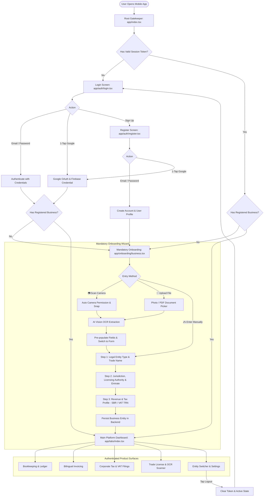

# Mizan (ميزان) - User Journeys & State Transitions

```mermaid
flowchart TD
    START([User Opens Mobile App]) --> SPLASH[Root Gatekeeper: app/index.tsx]
    SPLASH --> CHECK_AUTH{Has Valid Session Token?}

    CHECK_AUTH -- No --> LOGIN[Login Screen: app/auth/login.tsx]
    CHECK_AUTH -- Yes --> CHECK_BIZ{Has Registered Business?}

    LOGIN --> DO_LOGIN{Action}
    DO_LOGIN -- Email / Password --> AUTHENTICATE[Authenticate with Credentials]
    DO_LOGIN -- 1-Tap Google --> GOOGLE_AUTH[Google OAuth & Firebase Credential]
    DO_LOGIN -- Sign Up --> REGISTER[Register Screen: app/auth/register.tsx]

    REGISTER --> DO_REG{Action}
    DO_REG -- Email / Password --> CREATE_ACC[Create Account & User Profile]
    DO_REG -- 1-Tap Google --> GOOGLE_AUTH
    CREATE_ACC --> ONBOARDING[Mandatory Onboarding: app/onboarding/business.tsx]
    GOOGLE_AUTH --> CHECK_BIZ_AFTER_LOGIN

    AUTHENTICATE --> CHECK_BIZ_AFTER_LOGIN{Has Registered Business?}
    CHECK_BIZ_AFTER_LOGIN -- No --> ONBOARDING
    CHECK_BIZ_AFTER_LOGIN -- Yes --> DASHBOARD

    CHECK_BIZ -- No --> ONBOARDING
    CHECK_BIZ -- Yes --> DASHBOARD[Main Platform Dashboard: app/tabs/index.tsx]

    subgraph Mandatory Onboarding Wizard
        ONBOARDING --> CHOOSE_MODE{Entry Method}
        CHOOSE_MODE -- 📷 Scan Camera --> AUTO_PERM[Auto Camera Permission & Snap]
        AUTO_PERM --> AI_OCR[AI Vision OCR Extraction]
        CHOOSE_MODE -- 📁 Upload File --> PICKER[Photo / PDF Document Picker]
        PICKER --> AI_OCR
        AI_OCR --> PREFILL[Pre-populate Fields & Switch to Form]
        CHOOSE_MODE -- ✍️ Enter Manually --> STEP1
        PREFILL --> STEP1[Step 1: Legal Entity Type & Trade Name]
        STEP1 --> STEP2[Step 2: Jurisdiction, Licensing Authority & Emirate]
        STEP2 --> STEP3[Step 3: Revenue & Tax Profile - SBR / VAT TRN]
        STEP3 --> SUBMIT_BIZ[Persist Business Entity in Backend]
        SUBMIT_BIZ --> DASHBOARD
    end

    subgraph Authenticated Product Surfaces
        DASHBOARD --> BOOKS[Bookkeeping & Ledger]
        DASHBOARD --> INVOICES[Bilingual Invoicing]
        DASHBOARD --> TAX[Corporate Tax & VAT Filings]
        DASHBOARD --> SCANNER[Trade License & OCR Scanner]
        DASHBOARD --> PROFILE[Entity Switcher & Settings]
    end

    PROFILE -- Tap Logout --> LOGOUT[Clear Token & Active State]
    LOGOUT --> LOGIN
```
